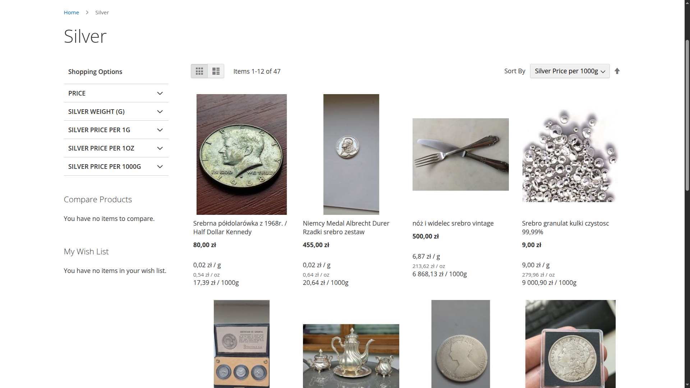
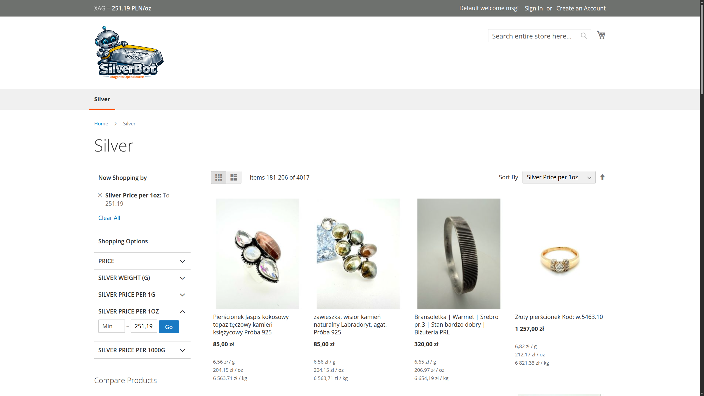
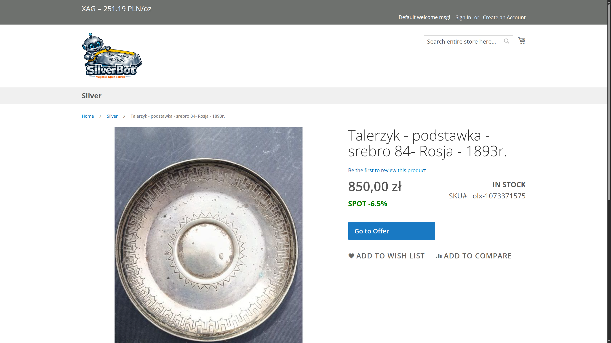
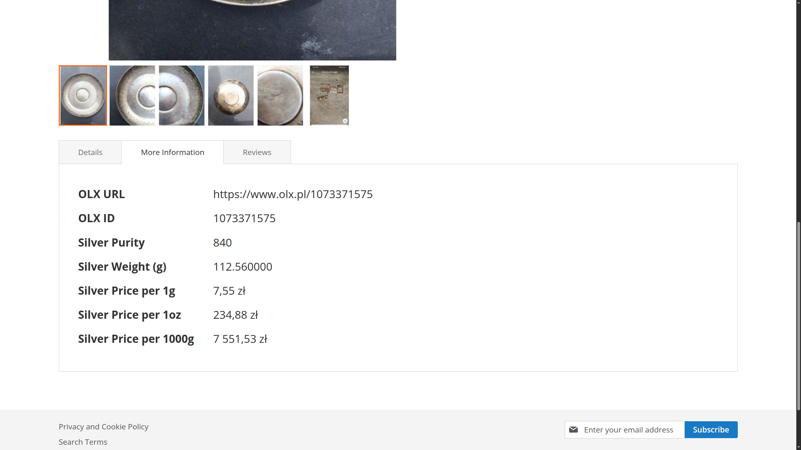
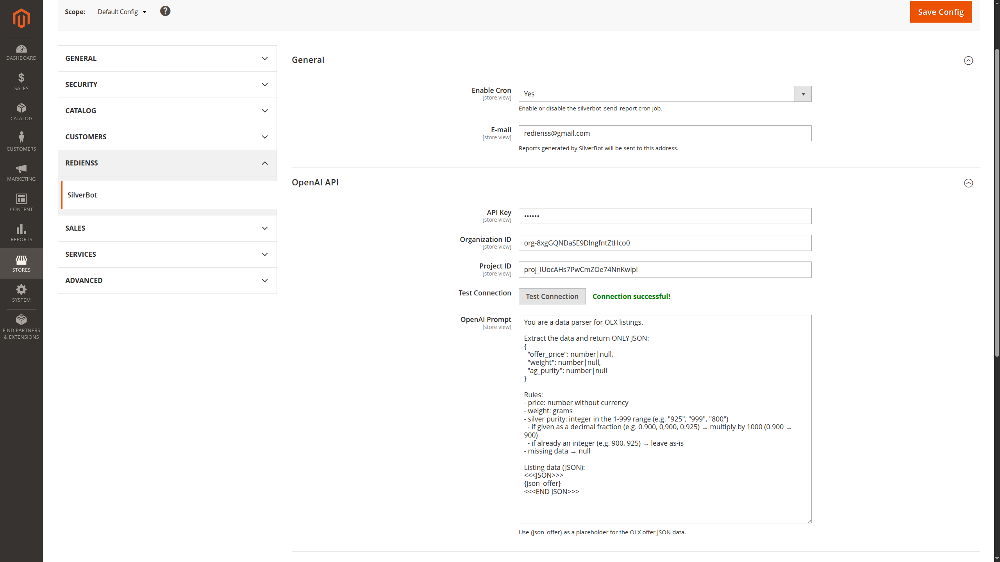
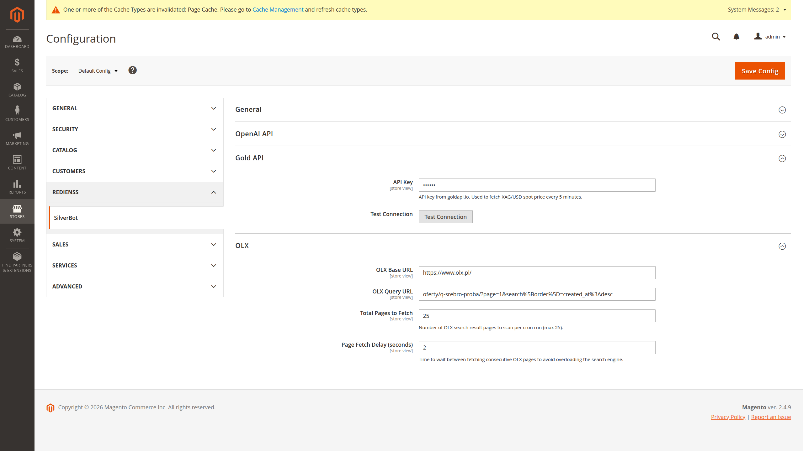
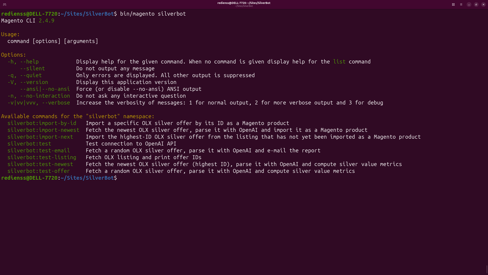
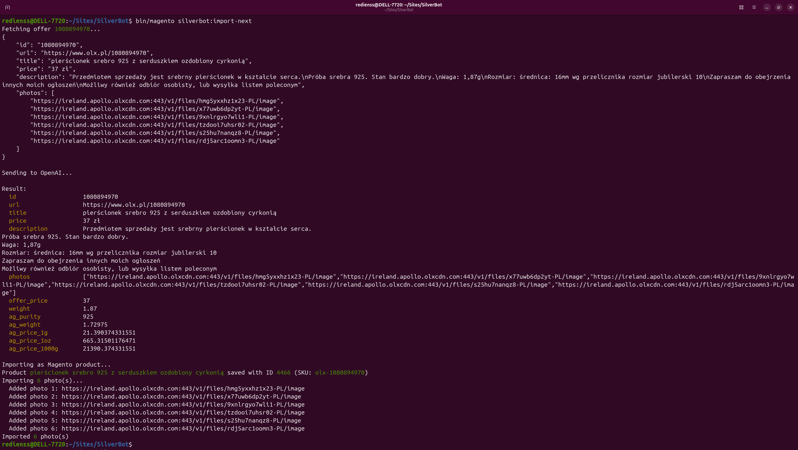

# SilverBot


A Magento 2 project that monitors the secondary silver market by automatically importing offers from OLX, enriching them with silver-specific metadata using OpenAI, and displaying live spot price data sourced from goldapi.io.

## Screenshots










## Overview

SilverBot scrapes silver coin and bullion listings from OLX, sends each offer's raw data to OpenAI for analysis, and creates Magento catalog products enriched with:

- silver purity (‰)
- pure silver weight (g)
- price per gram / per troy ounce / per kilogram of pure silver

The live XAG spot price (fetched daily from goldapi.io) is shown in the storefront header and on every product page as a premium/discount indicator relative to the spot price.

### Supported marketplaces

| Marketplace | Status |
|---|---|
| OLX | Supported |
| Others | Planned |

## How it works

```
OLX listing pages
      │
      ▼ (hourly cron)
Import Queue (DB table)
      │
      ▼ (every minute cron)
OLX offer page scrape
      │
      ▼
OpenAI chat completion
  → silver purity, weight, price parsing
      │
      ▼
Magento product created/updated
  + photos imported from OLX CDN
  + assigned to "Silver" category
```

### Cron jobs

| Job | Schedule | Description |
|---|---|---|
| `silverbot_populate_import_queue` | every hour | Scans configured OLX search pages, adds new offer IDs to the queue |
| `silverbot_import_queue_worker` | every minute | Processes one pending queue entry: scrapes OLX, calls OpenAI, creates/updates the product |
| `silverbot_fetch_metal_spot_price` | daily at midnight | Fetches current XAG/PLN spot price from goldapi.io |
| `silverbot_send_report` | daily at 09:00 | Sends a daily email report |

### Custom product attributes

| Attribute | Type | Description |
|---|---|---|
| `olx_id` | text | OLX offer ID |
| `olx_url` | text | Direct URL to the OLX listing |
| `ag_purity` | decimal | Silver purity in parts per thousand (‰) |
| `ag_weight` | decimal | Pure silver weight in grams |
| `ag_price_1g` | decimal | Price per gram of pure silver (PLN) |
| `ag_price_1oz` | decimal | Price per troy ounce (31.1 g) of pure silver (PLN) |
| `ag_price_1000g` | decimal | Price per kilogram of pure silver (PLN) |

All decimal attributes are filterable in layered navigation.

## Requirements

- Docker & Docker Compose
- Magento 2.4.x (PHP 8.4)
- OpenAI API key
- goldapi.io API key

## Installation

### 1. Start the Docker environment

```bash
bin/start
```

### 2. Enable the module

```bash
bin/magento module:enable Redienss_SilverBot
bin/magento setup:upgrade
bin/magento setup:di:compile
bin/magento cache:flush
```

### 3. Start the cron service

```bash
bin/cron start
```

## Configuration

All settings are available under **Stores → Configuration → Redienss → SilverBot**.

### OpenAI API

| Field | Description |
|---|---|
| API Key | Your OpenAI secret key (`sk-…`) |
| Organization ID | Optional — your OpenAI organization ID |
| Project ID | Optional — your OpenAI project ID |
| OpenAI Prompt | The prompt sent per offer. Use `{json_offer}` as the placeholder for the raw OLX offer JSON. The model must return a JSON object with fields: `offer_price`, `weight`, `ag_purity`. |

Use **Test Connection** to verify the API key before saving.

**Example prompt:**

```
You are a silver market analyst. Analyze the following OLX offer and return a JSON object with:
- offer_price (float, PLN) — the asking price
- weight (float, grams) — total weight of the item
- ag_purity (integer, ‰) — silver purity in parts per thousand (e.g. 925, 999)

Return only valid JSON, no explanation.

Offer data:
{json_offer}
```

### Gold API (goldapi.io)

| Field | Description |
|---|---|
| API Key | Your goldapi.io API key. Used to fetch the XAG/PLN spot price. |

Use **Test Connection** to verify the key before saving.

Register at [goldapi.io](https://www.goldapi.io/) to obtain a free or paid API key.

### General

| Field | Description |
|---|---|
| Enable Cron | Master switch for all SilverBot cron jobs |
| E-mail | Address to receive daily reports |

### OLX

| Field | Description |
|---|---|
| OLX Base URL | Base URL of the OLX site, e.g. `https://www.olx.pl/` |
| OLX Query URL | Relative search URL appended to the base URL, e.g. `oferty/q-srebro/` |
| Total Pages to Fetch | Number of search result pages to scan per hourly run (max 25) |
| Page Fetch Delay (seconds) | Delay between fetching consecutive pages to avoid overloading OLX |

## CLI commands

These commands run inside the Magento container (`bin/magento <command>`):

| Command | Description |
|---|---|
| `silverbot:import-newest` | Imports the newest offer from the configured OLX query URL |
| `silverbot:import-next` | Processes the next pending entry from the import queue |
| `silverbot:import-by-id <id>` | Imports a single OLX offer by its ID |
| `silverbot:test` | Basic connectivity test |
| `silverbot:test-offer <id>` | Fetches and displays a raw OLX offer |
| `silverbot:test-listing` | Fetches and displays the offer ID list from the configured search URL |
| `silverbot:test-newest` | Fetches the newest offer and displays the OpenAI-enriched data without importing |
| `silverbot:test-email` | Sends a test report email to the configured address |

Example:

```bash
bin/magento silverbot:import-by-id 12345678
```

## Docker services

The environment is based on [markshust/docker-magento](https://github.com/markshust/docker-magento) and includes:

| Service | Image |
|---|---|
| Nginx | `markoshust/magento-nginx:1.28` |
| PHP-FPM | `markoshust/magento-php:8.4-fpm` |
| MariaDB | `mariadb:11.4` |
| Redis / Valkey | `valkey/valkey:8.1-alpine` |
| OpenSearch | `markoshust/magento-opensearch:3` |
| RabbitMQ | `markoshust/magento-rabbitmq:4.2` |
| Mailcatcher | `sj26/mailcatcher:v0.10.0` |

Use `make help` to list all available `bin/` shortcuts.