# SilverBot


A Magento 2 project that monitors the secondary silver market by automatically importing offers from OLX, enriching them with silver-specific metadata using OpenAI, and displaying live spot price data alongside historical XAG/PLN price charts.

## Screenshots

**Storefront — category listing with silver-specific layered navigation and saved filters**

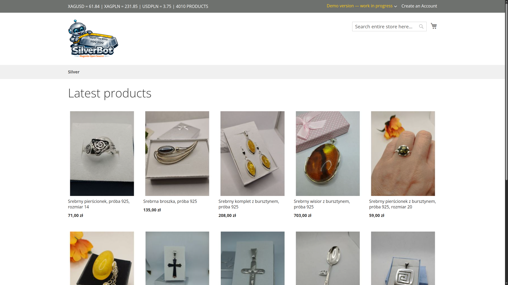
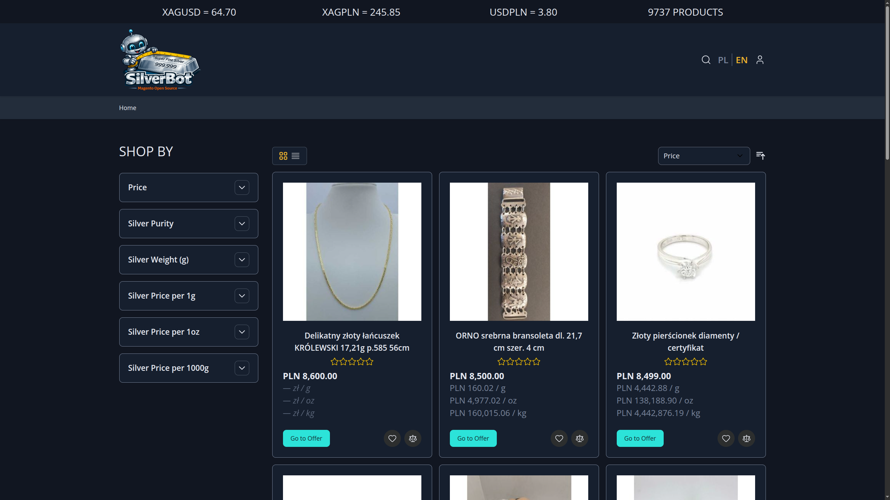

**Product page — spot premium/discount, details, price chart and composition**

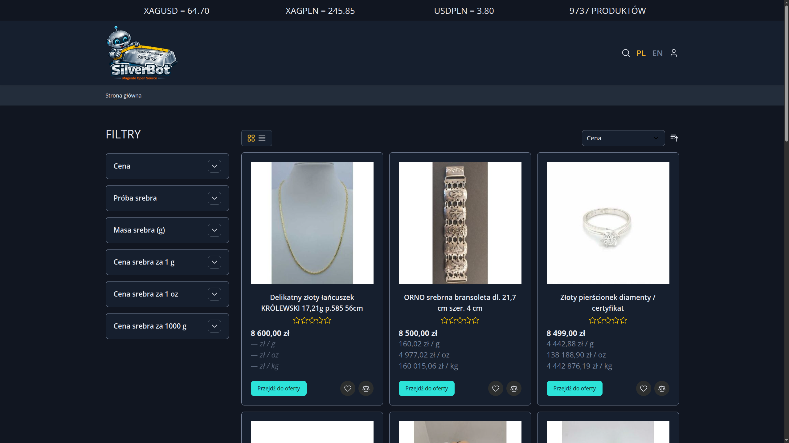
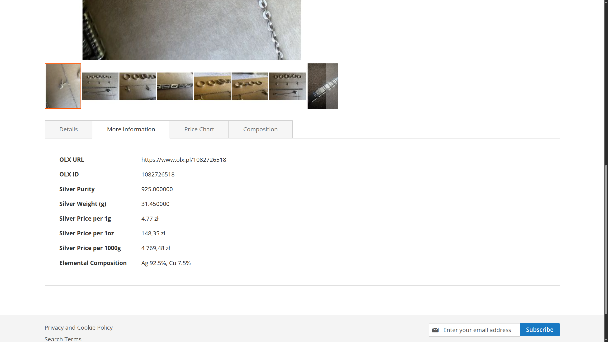
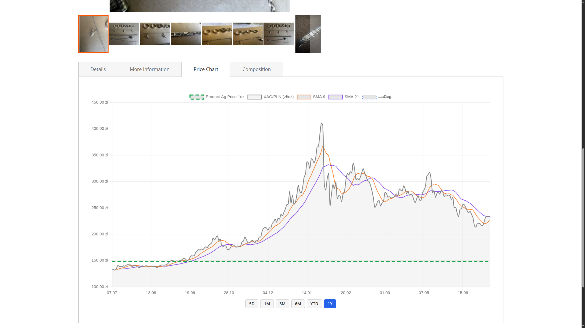
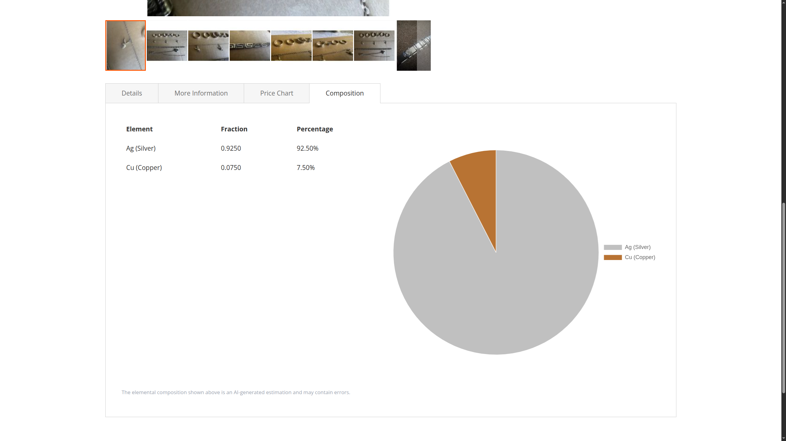

**E-mail alerts (desktop and mobile)**

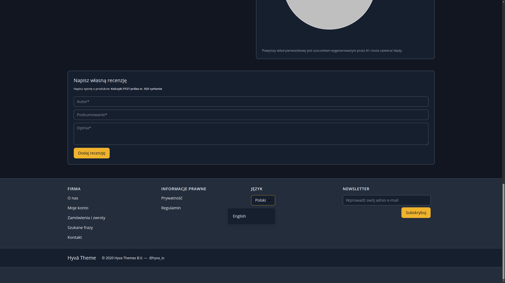
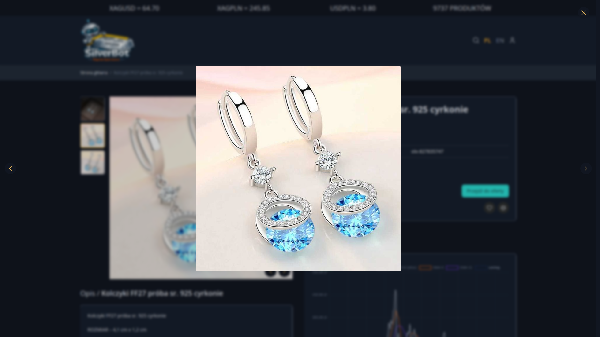

**CLI and admin configuration**

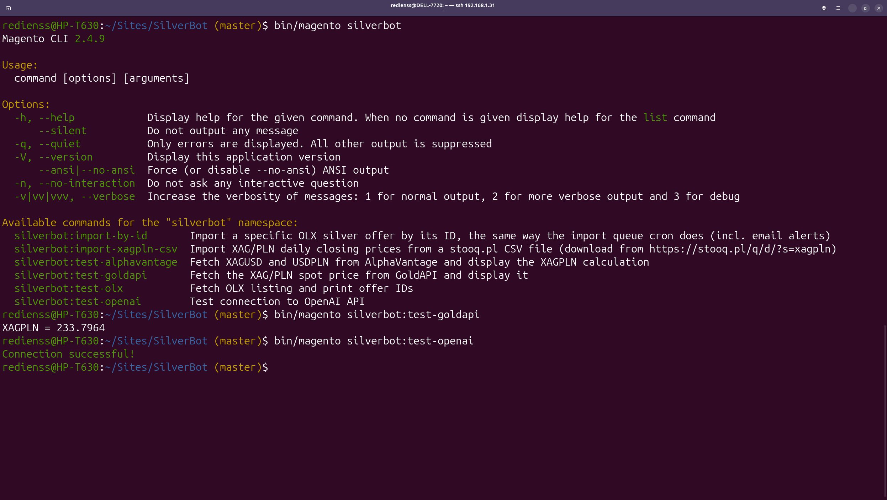
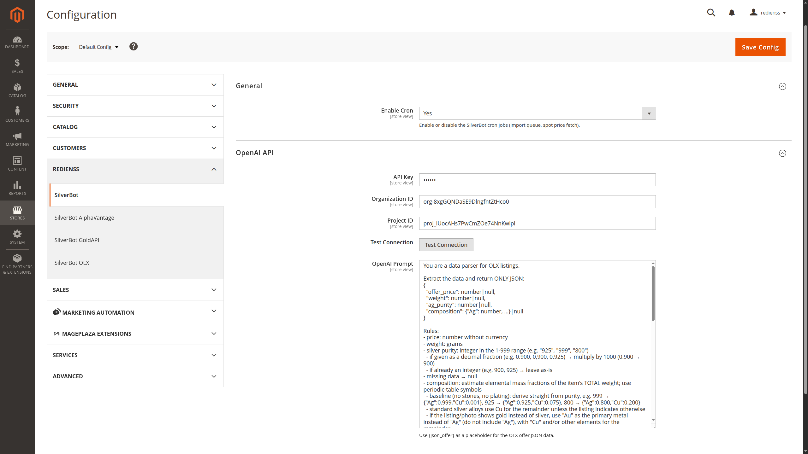
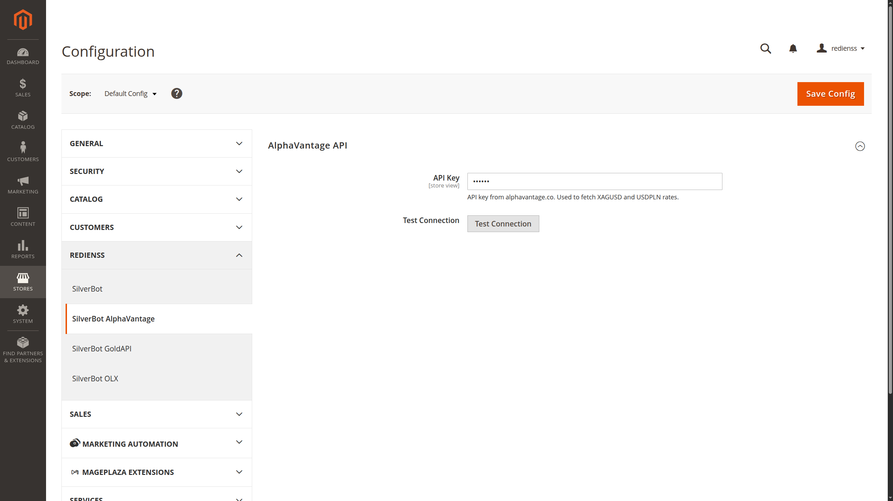
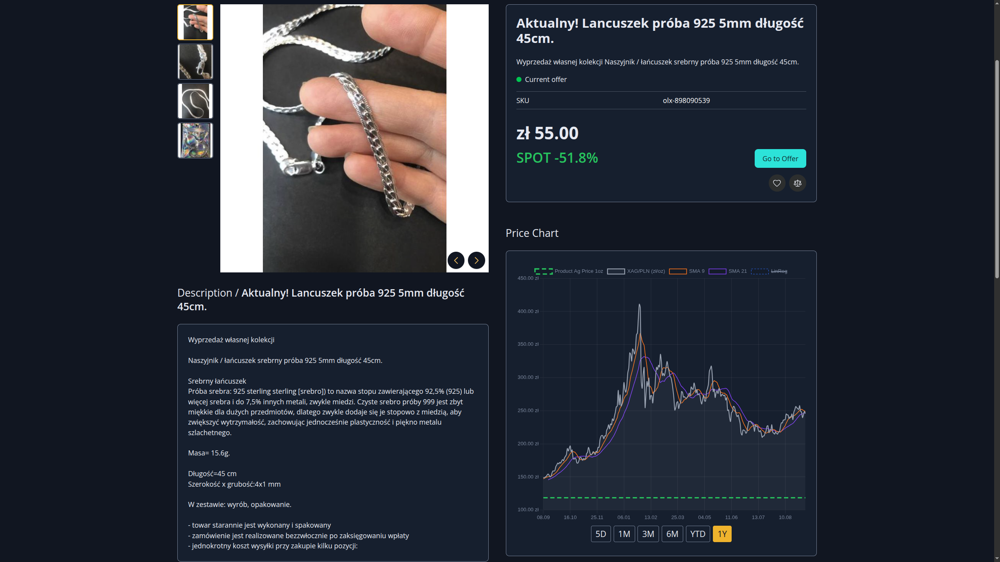
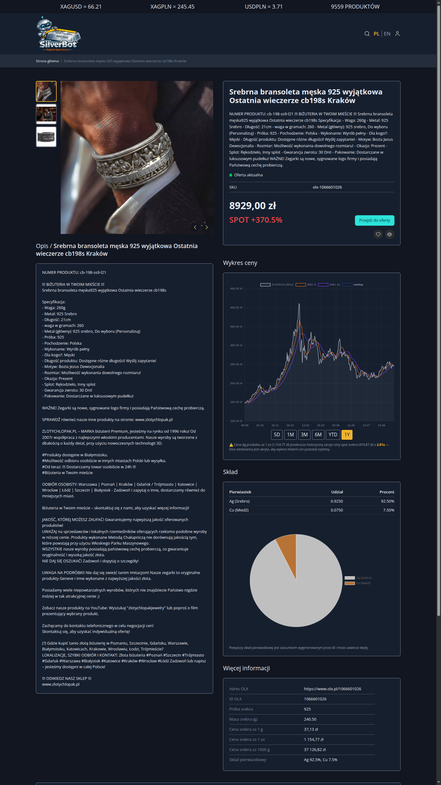

## Overview

SilverBot scrapes silver coin, bullion and jewellery listings from OLX, sends each offer's raw data to OpenAI for analysis, and creates Magento catalog products enriched with:

- silver purity (‰)
- pure silver weight (g)
- price per gram / per troy ounce / per kilogram of pure silver
- estimated elemental composition (e.g. `Ag 92.5%, Cu 7.5%`)

The live XAG/PLN spot price (fetched from AlphaVantage) is shown in the storefront header — together with XAG/USD and USD/PLN — and on every product page as a premium/discount indicator relative to spot. Each product page also carries a historical **Price Chart** (XAG/PLN with moving averages and a linear-regression channel) and a **Composition** breakdown.

Logged-in customers can save layered-navigation filters and opt in to e-mail alerts, which fire automatically whenever a newly imported product matches a saved filter's criteria.

### Supported marketplaces

| Marketplace | Status |
|---|---|
| OLX | Supported |
| Others | Planned |

## Modules

SilverBot is split into focused modules so that data sources can be swapped independently:

| Module | Responsibility |
|---|---|
| `Redienss_SilverBot` | Core: import queue, OpenAI enrichment, product creation, price chart, composition, saved filters, alert e-mails |
| `Redienss_SilverBotOlx` | OLX scraping — listing/offer fetching and configuration |
| `Redienss_SilverBotGoldAPI` | XAG/USD spot price via [goldapi.io](https://www.goldapi.io/) (alternative source, CLI + admin test) |
| `Redienss_SilverBotAlphaVantage` | XAG/USD and USD/PLN via [alphavantage.co](https://www.alphavantage.co/); source used by the spot-price cron |

## How it works

```
OLX listing pages
      │
      ▼ (hourly cron)
Import Queue (DB table)
      │
      ▼ (every 2 minutes cron)
OLX offer page scrape
      │
      ▼
OpenAI chat completion
  → silver purity, weight, price parsing, elemental composition
      │
      ▼
Magento product created/updated
  + photos imported from OLX CDN
  + assigned to "Silver" category
      │
      ▼
Saved-filter match check → alert e-mail to subscribed customers
```

### Cron jobs

| Job | Schedule | Description |
|---|---|---|
| `silverbot_populate_import_queue` | every hour | Scans configured OLX search pages, adds new offer IDs to the queue |
| `silverbot_import_queue_worker` | every 2 minutes | Processes one pending queue entry: scrapes OLX, calls OpenAI, creates/updates the product and sends any matching alert e-mails |
| `silverbot_fetch_metal_spot_price` | every 2 hours | Fetches XAG/USD and USD/PLN from AlphaVantage and stores the derived XAG/PLN spot price |

All cron jobs are gated by the **Enable Cron** master switch.

### Custom product attributes

| Attribute | Type | Description |
|---|---|---|
| `olx_id` | text | OLX offer ID |
| `olx_url` | text | Direct URL to the OLX listing |
| `ag_purity` | decimal | Silver purity in parts per thousand (‰) |
| `ag_weight` | decimal | Pure silver weight in grams |
| `ag_price_1g` | decimal | Price per gram of pure silver (PLN) |
| `ag_price_1oz` | decimal | Price per troy ounce (31.1 g) of pure silver (PLN) |
| `ag_price_1000g` | decimal | Price per kilogram of pure silver (PLN) |
| `composition` | textarea (JSON) | AI-estimated elemental mass fractions, rendered as `Ag 92.5%, Cu 7.5%` and a pie chart |

The decimal price/weight/purity attributes are filterable in layered navigation. **Silver Weight (g)** and the per-unit price attributes support min–max range filtering.

## Storefront features

- **Header spot stats** — live XAG/USD, XAG/PLN, USD/PLN and total product count.
- **Silver-specific layered navigation** — filter by purity, weight (range) and price per 1 g / 1 oz / 1000 g of pure silver.
- **Saved filters & alerts** — logged-in customers save the current filter set and toggle e-mail alerts per filter; new imports matching a saved filter trigger a notification e-mail.
- **Per-unit price on tiles** — listing and widget tiles show price per gram/oz/kg and a **Go to Offer** link (in place of Add to Cart) that deep-links to the original OLX listing.
- **Product page tabs**
  - **More Information** — OLX URL/ID, purity, weight, per-unit prices, elemental composition.
  - **Price Chart** — historical XAG/PLN price with SMA 9, SMA 21, a toggleable linear-regression channel and a dashed line for the product's own per-oz silver price, with `5D / 1M / 3M / 6M / YTD / 1Y` ranges (Chart.js).
  - **Composition** — AI-estimated elemental breakdown as a table and pie chart.
- **Spot premium/discount** — each product shows how its implied silver price compares to live spot (e.g. `SPOT -36.0%`).

## Requirements

- Docker & Docker Compose
- Magento 2.4.x (PHP 8.4)
- OpenAI API key
- AlphaVantage API key (spot price cron); optionally a goldapi.io key
- [mageplaza/module-smtp](https://github.com/mageplaza/magento-2-smtp) configured for outgoing alert e-mails

## Installation

### 1. Start the Docker environment

```bash
bin/start
```

### 2. Enable the modules

```bash
bin/magento module:enable Redienss_SilverBotOlx Redienss_SilverBot Redienss_SilverBotGoldAPI Redienss_SilverBotAlphaVantage
bin/magento setup:upgrade
bin/magento setup:di:compile
bin/magento cache:flush
```

### 3. Start the cron service

```bash
bin/cron start
```

## Configuration

All settings live under **Stores → Configuration → Redienss**, split by module: **SilverBot**, **SilverBot AlphaVantage**, **SilverBot GoldAPI** and **SilverBot OLX**.

### SilverBot → General

| Field | Description |
|---|---|
| Enable Cron | Master switch for all SilverBot cron jobs (import queue, spot price fetch) |

### SilverBot → OpenAI API

| Field | Description |
|---|---|
| API Key | Your OpenAI secret key (`sk-…`) |
| Organization ID | Optional — your OpenAI organization ID |
| Project ID | Optional — your OpenAI project ID |
| OpenAI Prompt | The prompt sent per offer. Use `{json_offer}` as the placeholder for the raw OLX offer JSON. The model must return a JSON object with fields: `offer_price`, `weight`, `ag_purity`, `composition`. |

Use **Test Connection** to verify the API key before saving.

**Default prompt** (this is the value pre-filled in the admin config — copy it verbatim if you ever need to restore it):

```
You are a data parser for OLX listings.

Extract the data and return ONLY JSON:
{
  "offer_price": number|null,
  "weight": number|null,
  "ag_purity": number|null,
  "composition": {"Ag": number, ...}|null
}

Rules:
- price: number without currency
- weight: grams
- silver purity: integer in the 1-999 range (e.g. "925", "999", "800")
  - if given as a decimal fraction (e.g. 0.900, 0,900, 0.925) → multiply by 1000 (0.900 → 900)
  - if already an integer (e.g. 900, 925) → leave as-is
- missing data → null
- composition: estimate elemental mass fractions of the item's TOTAL weight; use periodic-table symbols
  - baseline (no stones, no plating): derive straight from purity, e.g. 999 → {"Ag":0.999,"Cu":0.001}, 925 → {"Ag":0.925,"Cu":0.075}, 800 → {"Ag":0.800,"Cu":0.200}
  - standard silver alloys use Cu for the remainder unless the listing indicates otherwise
  - if the listing/photo shows gold instead of silver, use "Au" as the primary metal instead of "Ag" (do not include "Ag"), with "Cu" and/or other elements for the remainder
  - if the item is gold-plated (silver or base metal), add a small "Au" fraction for the plating, e.g. 0.003-0.010, then scale the rest down so everything still sums to 1.0
  - gemstones, glass, or mineral stones → include as "Si" (or a more specific element symbol if the material is clearly identifiable, e.g. quartz-like minerals as "Si")
  - pearls or other organic material → include as "Ca"
  - stone/non-metal weight share: look at the stone(s) size relative to the whole item in the photo and estimate what fraction of the TOTAL weight they represent - a small accent stone ≈ 0.05-0.15, a single prominent centerpiece stone ≈ 0.20-0.40, large and/or multiple large stones covering much of the piece ≈ 0.50-0.70+
  - once a stone/non-metal fraction is estimated, the metal elements must be scaled down proportionally so metal + stones = 1.0 - do NOT just append the stone fraction on top of the full-purity metal split
    - e.g. purity 800 with an estimated 50% stone share → {"Si":0.500,"Ag":0.400,"Cu":0.100} (correct, sums to 1.0), NOT {"Si":0.500,"Ag":0.800,"Cu":0.200} (wrong, sums to 1.5)
  - every element actually present in the item must have a value greater than 0 - never output 0 or 0.0 for an element you've included (e.g. a bracelet with visible stones must have "Si" > 0)
  - all composition values must sum to exactly 1.0
  - if purity is unknown → set composition to null

The first photo from the listing is also attached.

Use both:
1. the JSON listing data below
2. the attached image

If the image clearly shows:
- silver hallmarks or purity stamps,
- weight markings,
- coin or bar inscriptions,
- manufacturer markings,

use that information to fill or correct the extracted values.

If the image contradicts the text, prefer the information visible in the image only when it is clear and unambiguous.

Return ONLY the JSON object.

Listing data (JSON):
<<<JSON>>>
{json_offer}
<<<END JSON>>>
```

### SilverBot AlphaVantage → AlphaVantage API

| Field | Description |
|---|---|
| API Key | Your alphavantage.co API key. Used to fetch XAG/USD and USD/PLN, from which the XAG/PLN spot price is derived by the daily cron. |

Use **Test Connection** to fetch the current XAG/USD and USD/PLN and preview the XAG/PLN calculation. Register at [alphavantage.co](https://www.alphavantage.co/) to obtain a free key.

### SilverBot GoldAPI → Gold API

| Field | Description |
|---|---|
| API Key | Your goldapi.io API key. Provides an alternative single-call XAG/USD spot price source (available via CLI and the admin test button). |

Use **Test Connection** to verify the key. Register at [goldapi.io](https://www.goldapi.io/) to obtain a key.

### SilverBot OLX → OLX

| Field | Description |
|---|---|
| OLX Base URL | Base URL of the OLX site, e.g. `https://www.olx.pl/` |
| OLX Query URL | Relative search URL appended to the base URL, e.g. `oferty/q-srebro-proba/` |
| Total Pages to Fetch | Number of search result pages to scan per hourly run (max 25) |
| Page Fetch Delay (seconds) | Delay between fetching consecutive pages to avoid overloading OLX |

## CLI commands

These commands run inside the Magento container (`bin/magento <command>`):

| Command | Description |
|---|---|
| `silverbot:import-by-id <id>` | Imports a single OLX offer by its ID, the same way the import queue cron does (including e-mail alerts) |
| `silverbot:import-xagpln-csv <file>` | Imports XAG/PLN daily closing prices from a stooq.pl CSV file (download from `https://stooq.pl/q/d/?s=xagpln`) — populates the historical price chart |
| `silverbot:test-openai` | Tests connectivity to the OpenAI API |
| `silverbot:test-olx` | Fetches the OLX listing and prints the offer IDs from the configured search URL |
| `silverbot:test-goldapi` | Fetches the XAG/PLN spot price from GoldAPI and displays it |
| `silverbot:test-alphavantage` | Fetches XAG/USD and USD/PLN from AlphaVantage and displays the XAG/PLN calculation |

Example:

```bash
bin/magento silverbot:import-by-id 1082726518
```

## Docker services

The environment is based on [markshust/docker-magento](https://github.com/markshust/docker-magento) and includes:

| Service | Image |
|---|---|
| Nginx | `markoshust/magento-nginx:1.28` |
| PHP-FPM | `markoshust/magento-php:8.4-fpm` |
| MariaDB | `mariadb:11.4` |
| Redis / Valkey | `valkey/valkey:8.1-alpine` |
| OpenSearch | `markoshust/magento-opensearch:3` |
| RabbitMQ | `markoshust/magento-rabbitmq:4.2` |
| Mailcatcher | `sj26/mailcatcher:v0.10.0` |

Use `make help` to list all available `bin/` shortcuts.
